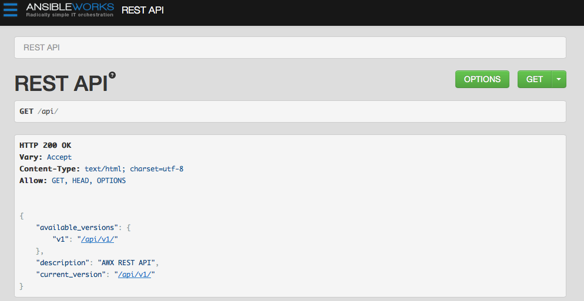

# Glossary

**Organization**: A logical collection of Users, Teams, Projects, and Inventories. The highest level in the AWX object hierarchy. See this description of the AWX [hierarchy](#AWX-Hierarchy).

**User**: An AWX operator with associated permissions and credentials.

**Organization Administrator**: An AWX user with the rights to modify the Organization's membership and settings, including making new users and projects within that organization. An organization admin can also grant permissions to other users within the organization.

**Team**: A sub-division of an Organization with associated Users, Projects, Credentials, and Permissions. Teams provide a means to implement role-based access control schemes and delegate responsibilities across Organizations.

**Project**: A logical collection of Ansible playbooks, represented in AWX.

**Inventory**: A collection of hosts against which Jobs may be launched.

**Credentials**: Authentication details that may be utilized by AWX to launch jobs against machines, to synchronize with inventory sources, and to import project content from a version control system.

**Job Template**: The combination of an Ansible playbook and the set of parameters required to launch it, designed to be reusable across hosts.

**Job**: The instantiation of a Job Template; the launch of an Ansible playbook.

**Permissions**: The set of privileges assigned to Users and Teams that provide the ability to read, modify, and administer Projects, Inventories, and other AWX objects.

**Host**: A system managed by AWX, which may include a physical, virtual, or cloud-based server, a network router, switch, or firewall, a storage device, or any unique system managed by AWX. Typically an operating system instance.

**Playbook**: An Ansible playbook.

**Super User**: An admin of the AWX server who has permission to edit any object in the system, whether associated to any organization. Super users can create organizations and other super users.

# Using LDAP with AWX

As of the 1.3 release of AWX, administrators may utilize LDAP as a source for authentication information for AWX users. At this time, only user authentication is provided and not synchronization of user permissions, credentials, or team membership, however organization membership (and who is an organization admin) can be synchronized.

When so configured, a user who logs in with an LDAP username and password will automatically get an AWX account created for them and they can be automatically placed into multiple organizations as either regular users or organization administrators.

By default, if users are created via an LDAP login, by default they cannot change their username, firstname, lastname, or set a local password for themselves. This is also tunable to restrict editing of other field names.

Currently, LDAP integration for AWX is configured in the file "/etc/awx/settings.py." No configuration is accessible via the AWX user interface. Please, review the comments in that file for information on LDAP configuration and let us know at [awx@ansibleworks.com](mailto:awx@ansibleworks.com) if you need assistance.

# Administration of AWX

Certain command line commands are available for management of AWX. In the future, some of these may be made available via GUI tools as well, and they may be augmented with other commands. Here is a useful subset. Do not run other awx-manage commands unless instructed by AnsibleWorks Support.

<blockquote class="note info">
<b>NOTE:</b> These commands should be run as the 'awx' user.
</blockquote>

`awx-manage inventory_import [--help]`

The inventory_import command is used to synchronize an AWX inventory object with a textbased inventory file, dynamic inventory script, or a directory of one or more of the above as supported by core Ansible.

When running this command, specify either an `--inventory-id` or `--inventory-name`, and the path to the Ansible inventory source is given by `--source`.

By default, inventory data already stored in AWX will be blended with data from the external source. To use only the external data, specify `--overwrite`. To specify that any existing hosts get variable data exclusively from the `--source`, specify `--overwrite-vars`. The default behavior will add any new variables from the external source, overwriting keys that do not already exist, but preserving any variables that were not sourced from the external data source.

# API

### Firebug, Chrome, and Charles Proxy

This document gives a basic understanding of the API, though you may wish to see what API calls AWX makes in sequence. To do this, using the UI from Firebug or Chrome with developer plugins is useful, though Charles Proxy (<http://www.charlesproxy.com/>) is also an outstanding visualizer that you may wish to investigate. It is commercial software but can insert itself as, for instance, an OS X proxy and intercept both requests from web browsers but also curl and other API consumers.

### Browseable API

AWX features a browseable API feature.

You can visit the API in a browser at `http://<AWX server name>/api` and then click on various links in the API to explore related resources.  

You can also PUT and POST on the specific API pages if you so desire by formatting JSON in the various text fields. 

### Conventions

With all of the basics about how to explore the API and database objects out of the way, it's now time for some general API info.

AWX uses a standard REST API, rooted at /api/ on the server. The API is versioned for compatibility reasons but only /api/v1/ is presently available. By querying /api you can see information about what API versions are available.

All data is JSON by default. You may have to specify the content/type on POST or PUT requests accordingly.

All URIs should end in "/" or you will get a 301 redirect.

### Sorting

Assume the following URL, `http://<AWX server name>/api/v1/groups/`

In order to sort the groups by name, access the following URL variation:

`http://<AWX server name>/api/v1/groups/?order_by=name`

You can order by any field in the object.

### Filtering

Any collection is what the system calls a "queryset" and can be filtered via various operators.

For example, to find the groups that contain the name "foo":

`http://<AWX server name>/api/v1/groups/?name__contains=foo`

To do an exact match:

`http://<AWX server name>/api/v1/groups/?name=foo`

If a resource is of an integer type, you must add "__int" to the end to cast your string input value to an integer, like so:

`http://<AWX server name>/api/v1/arbitrary_resource/?x__int=5`

Related resources can also be queried, like so:

`http://<AWX server name>/api/v1/groups/?user__firstname__icontains=john`

This will return all groups with users with names that include the string "John" in them.

You can also filter against more than one field at once:

`http://<AWX server name>/api/v1/groups/?user__firstname__icontains=john&group__name__icontains__foo`

This will find all groups containing a user whose name contains John where the group contains the string foo.

For more about what types of operators are available, see:

<https://docs.djangoproject.com/en/dev/ref/models/querysets/>

You may also wish to watch the API as the UI is being used to see how it is filtering on various criteria.

### Pagination

Responses for collections in the API are paginated. This means that while a collection may contain tens or hundreds of thousands of objects, in each web request, only a limited number of results are returned for API performance reasons.

When you get back the result for a collection you will see something like:

`{'count': 25, 'next': 'http://testserver/api/v1/some_resource?page=2', 'previous': None, 'results': [ ... ] }`

Where to get the next page, simply request the page given by the 'next' URL.

To request more items per page, pass the page size query string:

`http://<AWX server name>/api/v1/some_resource?page_size=50`

The serializer is quite efficient, but you should probably not request page sizes beyond a couple of hundred.

The user interface uses smaller values to avoid the user having to do a lot of scrolling.

### Read Only Fields

Certain fields in the REST API are marked read only. These usually include the URL of a resource, the ID, and occasionally some internal fields. For instance, the 'created_by' attribute of each object indicates which user created the resource, and cannot be edited.

If you post some values and notice they are not changing, these fields may be read only.

### API Example of Triggering A Job

For an example of how to launch an existing job template from a script, for integration with a Continuous Integration system or other program, please review the awx-cli project at <https://github.com/ansible/awx-cli>.

The awx-cli program is a command line utility used to send commands to the AWX API.