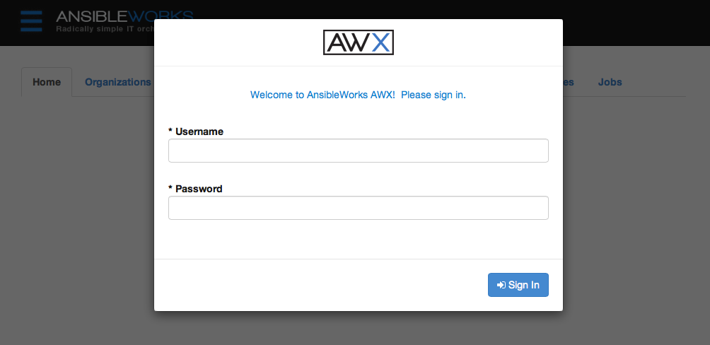
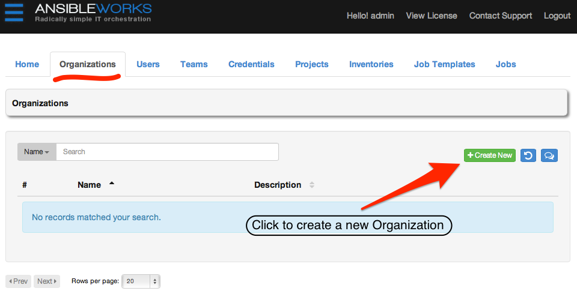
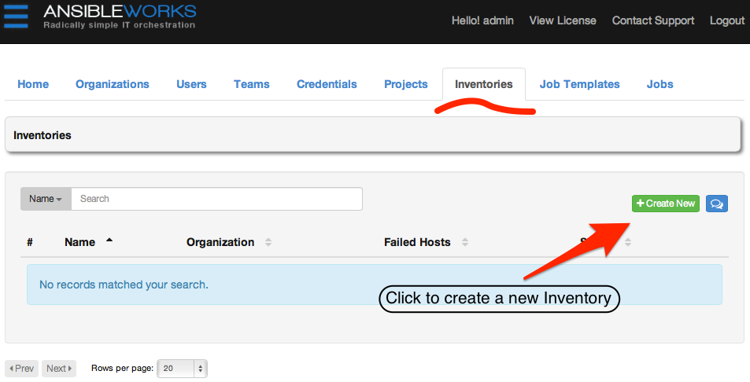
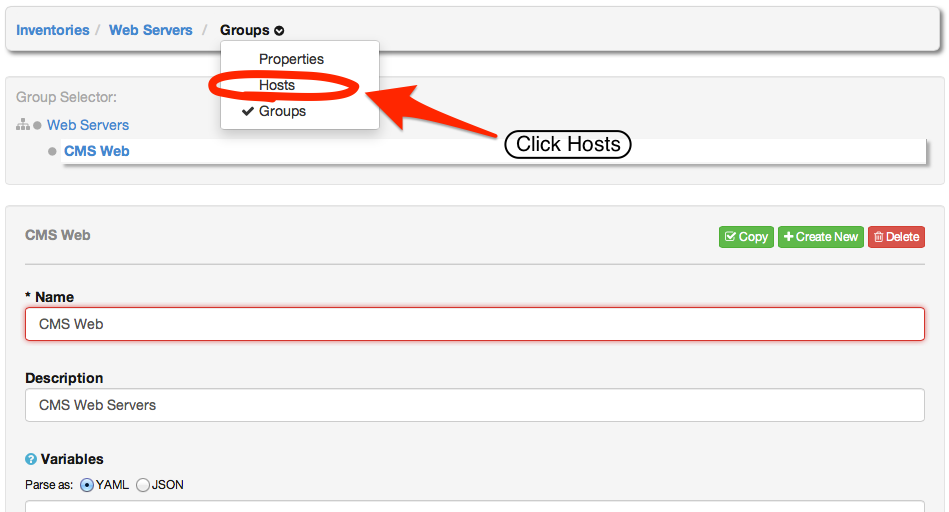

# Getting Started

Welcome to AnsibleWorks AWX!

To get started, first follow the installation instructions in the section entitled [Installation and Setup](#Installation-and-Setup). Then, either walk through the quick start below to quickly get up and running with AWX or browse through the documentation and design an implementation plan that works for you.

We value your feedback. Please contact us at [awx@ansibleworks.com](mailto:awx@ansibleworks.com) and let us know what you think and your ideas for future features!

## Installation and Setup

You can expect the installation of AWX to take less than fifteen minutes, depending on the speed of your network connection. (This installation will require that the AWX server be able to access the Internet.)

At the end of the installation, you will use your web browser to access AWX and utilize all of its capabilities.

<blockquote class="note info">
<b>NOTE:</b> Although AWX and Ansible are written in Python, they are full applications and not a simple Python library. Therefore AWX cannot be installed in a Python virtualenv or similar; you must install it as described in the installation instructions below.
</blockquote>

1. Install Ansible 1.3.x or later as detailed in the Ansible documentation at:

  <http://docs.ansible.com/intro_installation.html>.

  For convenience, we'll summarize those installation instructions here:

  a. For Red Hat Enterprise Linux 6 and CentOS 6:
 
    i. Configure the EPEL repository
  
    ```console
    root@localhost:~$ yum install http://mirror.oss.ou.edu/epel/6/x86_64/epel-release-6-8.noarch.rpm
    ```

    ii. Install Ansible
  
    ```console
    root@localhost:~$ yum install ansible
    ```

  b. For Ubuntu 12.04:

    i. Install Ansible dependencies
 
    ```console
    root@localhost:~$ apt-get install python-yaml python-paramiko python-jinja2 python-pip
    ```

    ii. Install Ansible
  
    ```console
    root@localhost:~$ pip install ansible
    ```

2. Download the AWX installer tarball from:

  <http://ansibleworks.com/releases/awx/setup/awx-setup-latest.tar.gz>

3. Extract the tarball and cd into the setup directory. Replace the string "VERSION" in the commands below with the version of AWX that you are installing e.g., "1.4.0".

  ```console
  root@localhost:~$ tar xvzf awx-setup-latest.tar.gz
  root@localhost:~$ cd awx-setup-VERSION
  ```

4. Edit the file `group_vars/all`. Modify the variable `pg_password` to change the default database password.

  <blockquote class="note info">
  <b>NOTE:</b> The password should not contain quotes.
  </blockquote>

5. If you wish to setup LDAP / Active Directory authentication for AWX, please review the section [Using LDAP with AWX](#Using-LDAP-with-AWX).

6. From the awx-setup-VERSION directory, run setup.sh

  <blockquote class="note info">
  <b>NOTE:</b> For users of Red Hat Enterprise Linux or CentOS, PackageKit can frequently interfere with the update mechanism. Consider disabling or removing PackageKit if installed prior to running the setup process.
  </blockquote>

  ```console
  root@localhost:~$ ./setup.sh
  ```

  a. Setup will install AWX from RPM or Deb packages using repos hosted on AnsibleWorks.com.

When setup completes successfully, you should be able to point your web browser to the AWX server and see the AWX login screen. 

If the installation of AWX fails or if you need assistance, please contact us at [awx@ansibleworks.com](mailto:awx@ansibleworks.com). AnsibleWorks subscription customers will receive a faster response by filing a support issue.

## Upgrade an Existing AWX Installation

You can upgrade your existing AWX installation the latest version by running the setup playbook for the new version of AWX. All data will be preserved. However, it is important that if you changed any of the parameters in the file `group_vars/all` (e.g. `pg_password`) that you make the same changes to the new `group_vars/all` file.

You can expect the upgrade of AWX to take less than fifteen minutes, depending on the speed of your network connection. (This installation will require that the AWX server be able to access the Internet.)

At the end of the upgrade, you will use your web browser to access the AWX server and utilize all of its capabilities.

This upgrade procedure assumes that you have a working installation of Ansible and AWX.

1. Backup the existing AWX database.

  ```console
  root@localhost:~$ awx-manage dumpdata > backup.json
  ```

2. Download the AWX installer tarball from:

  <http://ansibleworks.com/releases/awx/setup/awx-setup-latest.tar.gz>

3. Extract the tarball and cd into the setup directory. Replace "VERSION" with the version of AWX you are installing e.g., "1.4.0".

  ```console
  root@localhost:~$ tar xvzf awx-setup-latest.tar.gz
  root@localhost:~$ cd awx-setup-VERSION
  ```

4. Edit the file `group_vars/all`. Modify the variable `pg_password` to change the default database password.

5. If you wish to setup LDAP / Active Directory authentication for AWX, please review the section [Using LDAP with AWX](#Using-LDAP-with-AWX).

6. From the awx-setup-VERSION. directory, run setup.sh

  <blockquote class="note info">
  <b>NOTE:</b> For users of Red Hat Enterprise Linux or CentOS, PackageKit can frequently interfere with the update mechanism. Consider disabling or removing PackageKit if installed prior to running the setup process.
  </blockquote>

  ```console
  root@localhost:~$ ./setup.sh
  ```

  a. Setup will install AWX from RPM or Deb packages using repos hosted on AnsibleWorks.com.
 
When setup completes successfully, you should be able to point your web browser to the AWX server and see the AWX login screen.

If the upgrade of AWX fails or if you need assistance, please contact us at [awx@ansibleworks.com](mailto:awx@ansibleworks.com). AnsibleWorks subscription customers will receive a faster response by filing a support issue.

## Quick Start

After the installation of AWX is complete, we'll complete the following tasks to quickly set up and launch our first Ansible playbook using AWX. This first playbook launch will execute simple Ansible tasks to teach you how to use AWX and also ensure AWX is setup properly.

Here's a summary of the tasks we'll need to accomplish:

1. Login as Super User
2. Create an Organization
3. Add a new User to the organization
4. Add an Inventory to the organization
5. Create a set of Credentials
6. Create a Project
7. Create a new Job Template using an Ansible example playbook
8. Launch it!

You can expect the Quick Start to take less than thirty minutes, from beginning to end. At the end of the Quick Start, you'll have a functioning AWX that you can use to launch more sophisticated playbooks.

For the Quick Start, you will need to have completed the AWX installation and you will also need a target system to deploy the playbook to. This can be any sort of system that can be managed by Ansible.

<blockquote class="note info">
<b>NOTE:</b> The requirements for a system to be managed by Ansible are at <a href="http://docs.ansible.com/intro_installation.html">http://docs.ansible.com/intro_installation.html</a>.
</blockquote>

Ready? Let's go!

### 1. Login as Super User

First, log in to AWX by browsing to the AWX server URL at `http://<AWX server name>/`

Log in using the username and password set during the installation process. By default, this will be username: "admin" and password: "password". You can change this by clicking on the "admin" account on the users tab.

<blockquote class="note info">
<b>NOTE:</b> We'll get into the details of the differences between a normal user, superuser, and organization administrator in the section Users.
</blockquote>


From this main interface, we can access all aspects of AWX, including **Organizations**, **Users**, **Teams**, **Projects**, **Inventories**, **Credentials**, **Job Templates**, and **Jobs**. 

Keep in mind that the goal of this Quick Start is to launch a simple playbook. In order to do so, we'll need to set up a number of configuration options, but doing so now will ensure AWX is configured properly and allow us to easily execute more involved playbooks later while taking advantage of all the flexible role-based access control that AWX provides. You'll also get to know more about AWX along the way.

AWX provides multiple levels of role-based access, providing delegation of responsibility, but with fine - grained control over who can do what. We'll talk about that in more detail later in this document. For now, here's a simplified outline that shows the hierarchy of AWX's role based access control and the relationship between each element.

#### AWX Hierarchy

- Organization
  - Inventories
    - Groups
      - Hosts
  - Teams
    - Credentials
    - Permissions
    - Users
      - Credentials
      - Permissions
- Projects
  - Playbooks
  - Job Templates
- Jobs

Now, let's create a new organization within which we can create our first user, detail our inventory of hosts, and store SSH credentials for those hosts.

### 2. Create an Organization

Click on the **Organizations** tab. An Organization is a logical collection of Users, Teams, Projects, and Inventories. It is the highest level object in the AWX object hierarchy.

Then click **+Create New**. 

Enter a simple name and description for the organization. You can edit both of these fields later, so the values aren't critical. For our example, we will create an organization for a fictitious company called Bender Products Ltd. 

Organizations have both normal users and organization administrators. Organization Administrators are able to modify the membership and other properties of the organization, whereas normal users cannot. They are essentially super users but only within the scope of that organization. For more about the differences between users and administrators, see the section on [Users](#Users).

The "admin" user is a Super User account -- a de-facto administrator for all organizations, so let's use our admin powers to create a new user and add it to our new organization. When creating a new user, the checkbox **Superuser?** corresponds to this level of access. Only Super Users can create other Super Users or promote existing users to this level.

### 3. Create a new user and add the user to the organization

Expand the **Users** section (not the Users tab!) as shown here: 

Add a user by clicking the **+Add** button. 

A list of all existing users will be presented. Since we have not created any users, the only user listed is "admin". Click the **+Create New** button to create a brand new user. 

Enter the user's details. 

Click the **Save** button to save the user. You will be taken back to the organization details, where the new user we just created now appears on the list. 

Now, we have an organization and a user. Let's add an inventory of hosts we'll be managing for Bender Products.

### 4. Create a new inventory and add it to the organization

An inventory is a collection of hosts that can be managed with AWX. Inventories are assigned to organizations and permission to launch playbooks against inventories is controlled at the user and team level. More information can be found in the [Inventories](#Inventories) and [Permissions](#Permissions) sections.

Create a new inventory by browsing to the **Inventories** tab and clicking **+Create New**. 

Enter the values for **Name** and **Description**, and then click the look - up button to the left of the **Organization** field to select a value. For this example, the name of our inventory will be Web Servers. 

An Inventory is assigned to an organization. For our example we'll use the organization we created earlier. Select the row from the list by clicking on it. The selected row will be highlighted with a pastel green and a checkbox in the Select column. Click the **Select** button to confirm your choice. 

For now we will defer a discussion of variables until later and leave the Variables field alone. Click the **Save** button at the bottom of the page to create the inventory. 

After clicking **Save**, you will be taken to a screen allowing you to add groups to the new inventory. A tree on the left side of the page represents the Web Servers inventory. The inventory is empty at this point, so the tree consists only of a root node. 

Inventories are divided into groups. A group might represent a particular environment (e.g. "Datacenter 1" or "Stage Testing"), a type of server (e.g. "Application Servers" or "DB Servers"), or any representation of your physical environment.

Hosts are added to groups. They cannot be added directly to the inventory root. So to begin adding hosts to the Web Servers inventory, we first need to add a group. Click the **+Create New** button. 

Bender Products has a group of web server hosts supporting the corporate CMS application. To add these hosts to the Web Servers inventory we'll create a "CMS Web" group. Again, we will defer a discussion of variables for later. Click the **Save** button to create the group. 

Finally, we'll add a host to the group. First, expand the menu to select **Hosts**. 



Select **+Create New** to create the new host and add it to the group. 

Enter the Host Name, which should either be the DNS resolvable name of the host or its IP address. This is how AWX will contact the host, so the host must be reachable using this hostname or IP address for AWX to function properly. The **Description** is arbitrary, as usual. (<i>Note, experienced Ansible users will know they could also set the `ansible_ssh_host` environment variable to use an alias, but that is not going to be covered here</i>).

For the purposes of this Quick Start, add a host that you can actually reach via SSH and manage using Ansible (i.e. that meets the Ansible [requirements](http://docs.ansible.com/intro_installation.html)). We will launch a simple Ansible playbook that will not harm or modify the target in any way. Using a real target host allows us to ensure that AWX is setup properly.

 Click **Save** to finish adding the host. 


Next, we'll add credentials to our new user that AWX can use to access and launch Ansible playbooks for the host in our inventory.

### 5. Create a new set of credentials

Credentials are used to authenticate the AWX user to launch Ansible playbooks against inventory hosts and can include passwords and SSH keys. You can also require the AWX user to enter a password or key phrase when a playbook is launched using the credentials feature of AWX.

Create a new credential by browsing to the **Credentials** tab. Click **+Create New** to create a new credential. 

Enter an arbitrary **Name** and **Description** for this credential. Either an individual user or a team may own credentials. Let's associate this credential with the user we created in step #3.  

Next, select credential type **Machine**. 

Now, we'll enter the details of the appropriate authentication mechanism to use for the host we added to AWX in step #3. Use the actual credentials for the real host. To keep things simple, we'll use an SSH password, but ask for it at runtime. So, rather than enter the password here, we'll enter it later when we launch a playbook using these credentials. To do so, check the box **Ask at runtime for SSH Password**, as shown here.

<blockquote class="note info">
<b>NOTE:</b> AWX supports various different options for what you want to store for credentials in this box. Uploading a locked SSH key is recommended, and AWX can prompt you for the SSH unlock password for use with ssh-agent when launching the job. 
<br><br>
AWX encrypts passwords and key information in the AWX database and never makes secret information visible via the API.
</blockquote>


Click **Save**. 

Now, we'll create a new project and a job template with which to launch a simple playbook.

### 6. Create a new Project and select Create New.

Before we create this project, we'll need to create a subdirectory for it on the AWX server filesystem, where we will store the Ansible playbooks for this project.

<blockquote class="note info">
<b>NOTE:</b> This will require you to log into the AWX server on the command line console. In a future version of AWX, this will be done without leaving the Web interface.
</blockquote>

Create a new project directory by creating a directory on the AWX filesystem underneath the **Project Base Path**, by default "/var/lib/awx/projects".

```console
root@localhost:~$ cd /var/lib/awx/projects
root@localhost:~$ mkdir helloworld
```

While we're here, let's go ahead and create a simple Ansible playbook. Use your favorite editor to create a file called "helloworld.yml" inside the directory we just created, "/var/lib/awx/projects".

```console
root@localhost:~$ cd helloworld
root@localhost:~$ vi helloworld.yml
```

The contents of the file are below:

```yaml
---
- name: Hello World!
  hosts: all
  user: root
  
  tasks:
  
  - name: Hello World!
    shell: echo "Hi! AWX is working"
```

Save this playbook file and we'll use it to test AWX running a playbook against the host in our inventory.

<blockquote class="note info">
<b>NOTE:</b> Ansible playbooks utilize the YAML language. More information about Ansible playbooks may be found at: <a href="http://docs.ansible.com/playbooks.html">http://docs.ansible.com/playbooks.html</a>. More information on YAML can be found at: <a href="http://yaml.org/">http://yaml.org/</a>.
</blockquote>

Now, create the new project by browsing to the **Projects** tab. Click **+Create New**. 

Enter a **Name** and **Description** for the project.

The **Project Base Path** will display the value entered when AWX was installed and cannot be edited from this dialog. (See the section [Administration of AWX](#Administration-of-AWX) for more information on how to modify this value.)

Leave **SCM Type** set to Manual, for now.

For the **Playbook Directory** select a value that corresponds to the subdirectory we just created. 

<blockquote class="note info">
<b>NOTE:</b> If you see the following warning, double check that the helloworld project directory and file were created correctly and that the permissions are correct. Use <tt>chown -R awx</tt> on the project directory if necessary. If SE Linux is enabled, check the directory and file context.
<br><br>
"<b>WARNING</b>: There are no unassigned playbook directories in the base project path /var/lib/awx/projects. Either the projects directory is empty, or all of the contents are already assigned to other projects. New projects can be checked out from source control by changing the SCM type option rather than specifying checkout paths manually. To continue with manual setup, log into the AWX server and ensure content is present in a subdirectory under /var/lib/awx/projects. Run "chown -R awx" on the content directory to ensure awx can read the playbooks."
</blockquote>

Select **Save** and the new project will be displayed. 

Finally, let's create a job template for this new playbook and launch it.

### 7. Create a new Job Template using an Ansible example playbook

A job template combines an Ansible playbook from a project and the settings required to launch it. Create a new job template by browsing to the **Job Templates** tab and clicking **+Create New**. 

Enter values for the **Name** and **Description**. Jobs can be of type **Run** or **Check**. Select **Run** for this Quick Start (check corresponds to "dry run" mode.) Choose the **Inventory**, **Project**, and **Credential** from those we have created during this exercise.

The playbook drop - down menu will automatically populate from the project path and playbook we created in step #5. Choose the "helloworld" playbook. 

Click **Save**. 

Now, let's launch the playbook and watch it all come together.

### 9. Launch it!

To launch the playbook, browse to the **Job Templates** tab and click **Launch** on the template. 

AWX will ask you for the SSH password, as we configured the credential. 

AWX will then redirect the browser to the **Jobs** tab, where you can see the list of all jobs. 

Select the **Job ID** or click **View** and then **Status** to see the details of the job. When the job is complete, you should see output similar to the following. 

Click **Events** from the drop-down menu: 

The display will change to show the standard output from the host and the result of running our playbook. 

Great work! Your AWX installation is up and running properly. Now, you can browse through the [User Guide](#User-Guide) and learn about all of these features of AWX in more detail.

Don't hesitate to send your feedback to [awx@ansibleworks.com](mailto:awx@ansibleworks.com). We appreciate your support!
