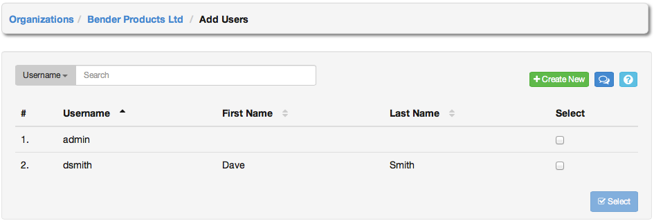
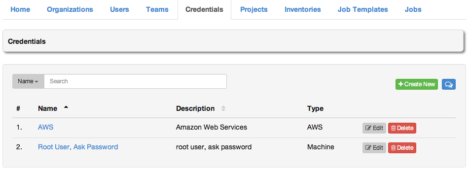
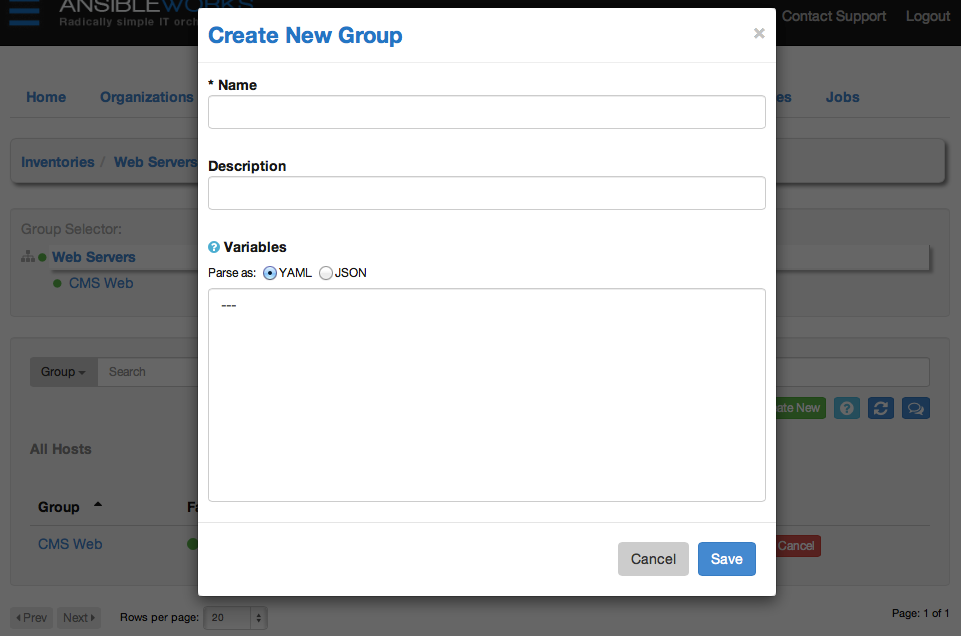

# User Guide

This section of the documentation will detail all of the functionality of AWX.

## Logging In

To log in to AWX, browse to the AWX interface at `http://<AWX server hostname or IP Address>/` 

Log in using a valid AWX username and password.

<blockquote class="note info">
<b>NOTE:</b> The default username and password set during installation are "admin" and "password", but the AWX administrator may have changed these settings during installation. If the default settings have not been changed, you can do from the Users tab.
</blockquote>

## Home

The central interface to AWX is the **Home** dashboard. This screen displays the status of AWX jobs, synchronization with inventory sources and source code management systems, and a summary of configured AWX objects. 

All of the list items displayed on the Home dashboard are linked to their respective AWX objects for convenient access.

## Organizations

An organization is a logical collection of **Users**, **Teams**, **Projects**, and **Inventories** and is the highest level in the AWX object hierarchy.

The **Organizations** tab displays all of the existing organizations for your installation of AWX. Organizations can be searched by **Name** or **Description**. Modify and remove organizations using the **Edit** and **Delete** buttons. 

Create a new organization by selecting **+Create New**.

1. Enter the **Name** for your organization.
2. Optionally, enter a **Description** for the organization.

 Click **Save** to finish creating the organization.

Once created, AWX will display the organization details, including two accordion-style menus below the organization name and description details that provide for managing users and administrators for the organization. 

### Users

A user is someone with access to AWX with associated permissions and credentials. For more information, please see the section [Users](#Users).

Expand the users menu by selecting **Users**. 

This menu allows you to manage the user membership for this organization. (User membership may also be managed on a per-user basis via the **Users** tab.) The user list may be sorted and searched by **Username**, **First Name**, or **Last Name**. Existing users may also be modified and removed using the **Edit** and **Delete** buttons.

To add users to the organization, click the **+Add** button. Then, select one or more users from the list of available users by clicking the **Select** checkbox or clicking anywhere on the user row. Click the **Select** button when done. 

To add a new user to AWX and to the organization, click the **+Create New** button, which takes us to the new user dialog. 

Enter the appropriate details into the following fields:

- Username
- First Name
- Last Name
- Email
- Organization
- Password
- Confirm Password
- Superuser? (Give this user Super User privileges for AWX. Caution!)

All of these fields are required. Select **Save** when finished and the user will be added to the organization.

### Organization Administrators

An organization administrator is a type of user that has the rights to create, modify, or delete objects in the organization, including projects, teams, and users in that organization. Expand the **Administrators** menu by selecting **Administrators**. 

This menu displays a list of the users that are currently an organization administrator of the organization. The administrator list may be sorted and searched by **Username**, **First Name**, or **Last Name**.

To add an administrator to the organization, click the **+Add** button.

<blockquote class="note info">
<b>NOTE:</b> A user must first be added to the Organization before it can be added to the list of Administrators for that Organization.
</blockquote>

Then, select one or more users from the list of available users by clicking the **Select** checkbox or clicking anywhere on the user row. Click the **Select** button when done. 

## Users

A user is someone who has access to AWX with associated permissions and credentials. The Users tab allows you to manage the all AWX users. The user list may be sorted and searched by **Username**, **First Name**, or **Last Name**. 

There are three types of AWX Users:

1. **Normal User**: read and write access is limited to the inventory and projects that the user has been granted the appropriate rights to via AWX Permissions.

2. **Organization Administrator**: the administrator of an organization has all of the rights of a normal user, as well as admin, read, and write permission over the entire organization and all of its inventories and projects, but does not have those levels of access on content belonging to other organizations. This level of user can create more users.

3. **Super User**: an AWX super user has admin, read, and write permissions over the entire AWX installation. A Super User is typically a systems administrator responsible for managing AWX, and would then delegate responsibilities for day-to-day work to various Organization Administrators.

<blockquote class="note info">
<b>NOTE:</b> The initial user (usually "admin") created by the AWX installation process is a Super User. One Super User must always exist, so if you wish to delete "admin", first create another Super User account.
</blockquote>

To create a new user click the **+Create New** button, which takes us to the new user dialog. 

Enter the appropriate details into the following fields:

- Username
- First Name
- Last Name
- Email
- Organization (Choose from an existing organization)
- Password
- Confirm Password
- Superuser? (Gives this user admin privileges for AWX. Caution!)

All of these fields are required. Select **Save** when finished.

Once the user is successfully created, AWX will open the **Edit User** dialog. This is the same menu that is opened if the **Edit** button is clicked from the **Users** tab. Here, **User Setting**, **Credentials**, **Permissions**, and other user membership details may be reviewed and modified. 

### Credentials

Credentials are utilized by AWX for authenticating when launching jobs against machines, to synchronize with inventory sources, and to import project content from a version control system. For details about how to use credentials, please see the section [Credentials](#Credentials).

To add credentials to user, expand the credentials menu and click the **+Add** button. 

Then, select one or more credentials from the list of available credentials by clicking the **Select** checkbox. Click the **Select** button when done. 

To add new credentials to the user click the **+Create New** button, which takes us to the **Create Credential** dialog. 

Enter the appropriate details depending on the type of credential and select **Save**.

### Permissions

Permissions are the set of privileges assigned to users and teams that provide the ability to read, modify, and administer projects, inventories, and other AWX elements. For details about how to use permissions, please see the section [Permissions](#Permissions).

This menu displays a list of the permissions that are currently available. The permissions list may be sorted and searched by **Name**, **Inventory**, **Project** or **Permission** type. 

To add new permissions to the user, click the **+Add** button, which takes us to the **Add Permission** dialog. 

Enter the appropriate details into the following fields:

- Permission Type
 * Inventory
 * Deployment
- Name
- Description

Selecting a **Permission Type** of either **Inventory** or **Deployment** will change the appearance of the **Add Permission** dialog to present appropriate options for each type of permission.

For a permission of type **Inventory**, enter the following details:

- Inventory (Select from the available inventories)
- Permission
  * Admin
  * Read
  * Write

For a permission of type **Deployment**, enter the following details:

- Project (Select from the available projects)
- Inventory (Select from the available inventories)
- Permission
  * Run
  * Check

Select **Save**.

### Admin of Organizations

This displays the list of organizations that this user is an administrator of. This list may be searched by **Organization Name** or **Description**. A user cannot be made an organization administrator from this interface panel. 

### Organizations

This displays the list of organizations that this user is a member of. This list may be searched by Organization Name or Description. Organization membership cannot be modified from this display panel. 

### Teams

This displays the list of teams that this user is a member of. This list may be searched by **Team Name** or **Description**. Team membership cannot be modified from this display panel. 

### Projects

This displays the list of projects that this user has access to. This list may be searched by **Project Name** or **Description**. Project access cannot be modified from this display. For more information about projects, please see the section [Projects](#Projects). 

## Teams

A team is a subdivision of an organization with associated users, projects, credentials, and permissions. Teams provide a means to implement role-based access control schemes and delegate responsibilities across organizations. For instance, permissions may be granted to a whole team rather than each user on the team.

This tab allows you to manage the teams for AWX. The user list may be sorted and searched by **Username**, **Description**, or **Organization**. 

To create a new team, click the **+Create New** button, which takes us to the **Create Team** dialog. 

Enter the appropriate details into the following fields:

- Name
- Description
- Organization (Choose from an existing organization)

All fields are required. Select **Save**.

Once the team is successfully created, AWX will open the Edit Team dialog. This is the same menu that is opened if the Edit button is clicked from the Teams tab. Here, Team Settings, Credentials, Permissions, Projects, and Users associated with this team may be reviewed and modified. 

### Credentials

Credentials are utilized by AWX for authenticating when launching jobs against machines, to synchronize with inventory sources, and to import project content from a version control system. For details about how to use credentials, please see the section [Credentials](#Credentials). 

To add credentials to the team, click the **+Add** button. Then, select one or more credentials from the list of available credentials by clicking the Select checkbox. Click the **Select** button when done. 

To create new credentials and add them to the team, click the **+Create New** button, which takes us to the **Create Credential** dialog. 

Enter the appropriate details depending on the type of credential and select **Save**.

### Permissions

Permissions are the set of privileges assigned to users and teams that provide the ability to read, modify, and administer projects, inventories, and other AWX elements. For details about how to use permissions, please see the section [Permissions](#Permissions).

This menu displays a list of the permissions that are currently available. The permissions list may be sorted and searched by **Name**, **Inventory**, **Project** or **Permission** type. 

To add new permissions to the team, click the **+Add button**, which takes us to the **Add Permission** dialog. 

Enter the appropriate details into the following fields:

- Permission Type
  * Inventory
  * Deployment
- Name
- Description

Selecting a **Permission Type** of either **Inventory** or **Deployment** will change the appearance of the **Add Permission** dialog to present appropriate options for each type of permission.

For a permission of type **Inventory**, enter the following details:

- Inventory (Select from the available inventories)
- Permission
  * Admin
  * Read
  * Write
 
For a permission of type **Deployment**, enter the following details:

- Project (Select from the available projects)
- Inventory (Select from the available inventories)
- Permission
  * Run
  * Check
 
Select **Save**.

### Projects

This displays the list of projects that this team has access to. This list may be searched by **Project Name** or **Description**. For more information about projects, please see the section [Projects](#Projects). 

To add a project to the team, click the "**+Add**" button. Then select one or more projects from the list of available credentials by clicking the Select checkbox or clicking anywhere on the user row. Click **Finished** when done. 

To create a new project and it to the team, **+Create New**, which takes us to the **Create Project** dialog. 

Enter the appropriate details into the following fields:

- Name
- Description
- Organization
- SCM Type
- Project Base Path
- Project Path

All fields are required. Select **Save**.

### Users

This menu displays the list of users that are members of this team. This list may be searched by **Username**, **First Name**, or **Last Name**. For more information on users, please see the section [Users](#Users). 

To add users to the team, click the **+Add** button. Then, select one or more users from the list of available users by clicking the **Select** checkbox or clicking anywhere on the user row. Click the **Select** button when done. 

## Permissions

Permissions are rights given to users to perform actions, including manage inventory and invoke Ansible playbooks / roles.

There are two permission types available to be assigned to users and teams, each with its own set of permissions available to be assigned:

- Inventory: grants permission to act on inventories, groups, and hosts
  * Admin: modify the settings for the specified inventory. This permission also grants Read and Write permissions.
  * Read: view groups and hosts within a specified inventory
  * Write: create, modify, and remove groups, and hosts within a specified inventory. Does not give permission to modify the inventory settings. This permission also grants the Read permission.
- Deployment: grants permission to launch jobs from the specified project against the specified inventory
  * Run: launch jobs of type Run. This permission also grants the Check permission.
  * Check: launch jobs of type Check.

Permissions do not have their own tab, but may be managed from either or both of the **Users** and **Teams** tabs. See those sections for information on how to modify, add, and delete permissions.

## Credentials

Credentials are utilized by AWX for authenticating when launching jobs against machines, to synchronize with inventory sources, and to import project content from a version control system.

<blockquote class="note info">
<b>NOTE:</b> AWX encrypts passwords and key information in the AWX database and never makes secret information visible via the API.
</blockquote>

The **Credentials** tab displays a list of the credentials that are currently available. The credentials list may be sorted and searched by **Name**, **Description**, or **Type**. 

Credentials may be managed from either the **Teams** tab or the Users tab. The **Credentials** tab simply provides a searchable and sortable list of credentials for your convenience.

To manage credentials for teams, please browse to the **Teams** tab and edit the appropriate team. Likewise, to manage credentials for a user, browse to the **Users** tab and edit the appropriate user.

Credentials added to a **Team** will be available to all members of the team, whereas credentials added to a user are only available to that user, by default.

#### There are four types of Credentials:

### Machine

Define SSH and Sudo access for playbooks. Used when submitting jobs to run playbooks on a remote host.

Machine credentials have several attributes that may be configured:

   - **SSH Password**
  
   The actual password to be used to authenticate the user via SSH. This password may be stored encrypted in the AWX database, if entered. Alternatively, you may configure AWX to ask the user for the password when a job that uses this credential is launched by selecting Ask at runtime. In that case, a dialog will open when the job
is launched where the user may enter the password and password confirmation.

   - **SSH Private Key**
  
   The actual SSH Private Key to be used to authenticate the user via SSH. This key is stored encrypted in the AWX database.

   - **SSH Private Key with Key Password**
  
   In addition to using an SSH private key, you may configure a Key Password associated with the private key. This password may be stored encrypted in the AWX database, if entered. Alternatively, you may configure AWX to ask the user for the password when a job that uses this credential is launched by selecting Ask at runtime. In that case, a dialog will open when the job is launched where the user may enter the password and password confirmation.

   - **Sudo Password**
  
   The actual password to be used to authenticate the user via sudo. This password may be stored encrypted in the AWX database, if entered. Alternatively, you may configure AWX to ask the user for the password when a job that uses this credential is launched by selecting Ask at runtime. In that case, a dialog will open when the job
is launched where the user may enter the password and password confirmation.

   Sudo Password must be used in combination with one of the other methods, since AWX must first establish an authenticated SSH connection with the host prior to invoking sudo to change to the sudo user.

### AWS

Enables synchronization of cloud inventory with Amazon Web Services. Requires the AWS Access Key and Secret Key.

### Rackspace

Enables synchronization of cloud inventory with Rackspace. Requires the Rackspace Username and API Key.

### SCM

Used on projects to clone and update local source code repositories from a remote revision control system such as Git, SVN or Mercurial. 

## Projects

A Project is a logical collection of Ansible playbooks, represented in AWX.

Add your Ansible projects to the filesystem of your AWX installation under the project base path. You can do this by either managing playbooks and playbook directories manually or by using a source code management (SCM) system supported by AWX, including Git, Subversion, and Mercurial.

<blockquote class="note info">
<b>NOTE:</b> By default, the <b>Base Project Path</b> is /var/lib/awx/projects, but this may have been modified by the AWX administrator. It is configured in /etc/ansibleworks/settings.py. Use caution when editing this file, as it is possible to disable your installation.
</blockquote>

This menu displays a list of the projects that are currently available. The list of projects may be sorted and searched by **Project Name**, **Description**, by the time the project was **Last Updated**, or by **Status**. From the **Projects** tab, you can also modify and remove existing projects, using the **Edit** and **Delete** buttons.

For projects managed via Source Code Management (SCM), the Status button will display the update status for the project and Update will invoke an immediate SCM update for the project.

Status may be one of the following:

- Updating - an update is in progress
- Never updated - project has never been updated
- Failed - last update failed
- Successful - last updated succeeded
- Missing - project has a last update, but the project directory is missing, or project doesn't use SCM and the directory is missing
- Ok - project doesn't use SCM, and the directory is present


Refresh the list of projects with the **Refresh** button. To create a new project, click the **+Create New** button, which takes us to the **Create Project** dialog.

<blockquote class="note info">
<b>NOTE:</b> If you have not added any Ansible playbook directories to the base project path, then you will receive the following message from AWX:
<br><br>
"<b>WARNING</b>: There are no unassigned playbook directories in the base project path /var/lib/awx/projects. Either the projects directory is empty, or all of the contents are already assigned to other projects. New projects can be checked out from source control by changing the SCM type option rather than specifying checkout paths manually. To continue with manual setup, log into the AWX server and ensure content is present in a subdirectory under /var/lib/awx/projects. Run "chown -R awx" on the content directory to ensure awx can read the
playbooks."
<br><br>
Correct this issue by creating the appropriate playbook directories and checking out playbooks from your SCM or otherwise copying playbooks into the appropriate playbook directories.
</blockquote>


Enter the appropriate details into the following fields:

- Name
- Description
- Organization
  A project must have at least one organization. Pick one organization now to create the project, and then after the project is created you can add additional organizations.
- SCM Type
  Select one of Manual, Git, SVN, or Mercurial. (See the appropriate section below for more detail.)
- Project Base Path (Shown here as a convenience. A future release may make this usereditable.)
- Project Path (The project paths show here are automatically read from the directory tree with a root of the project base path.)

All fields are required. Select **Save**.

<blockquote class="note info">
<b>NOTE:</b> Each project path can only be assigned to one project. If you receive the following message, ensure that you have not already assigned the project path to an existing project.
<br><br>
All of the project paths have been assigned to existing projects, or there are no directories found in the base path. You will need to add a project path before creating a new project.
</blockquote>

To manage playbooks manually:

1. Create one or more directories to store playbooks under the Project Base Path (e.g. "/var/lib/awx/projects/")
2. Create or copy playbook files into the playbook directory(s).
3. Ensure that the playbook directory(s) and files are owned by the same UNIX user and group that the AWX service runs as.
4. Ensure that the permissions are appropriate for the playbook directory(s) and files.

If you have trouble adding a project path, check the permissions and SE Linux context settings for the project directory and files.

To manage playbooks using SCM, select the appropriate **SCM Type**. 

Enter the appropriate details into the following fields:

- SCM URL

- SCM Branch
  
  Optionally enter the SCM branch for Git or Mercurial

- Revision # (SVN only)

  Optionally enter the Revision # for Subversion
   
- If authentication is required, select the appropriate SCM credentials.

- Clean

  Remove any local modifications prior to performing an update.
  
- Delete on Update

  Delete the local repository in its entirety prior to performing an update. Depending on the size of the repository this may significantly increase the amount of time required to complete an update.

- Update on Launch

  Each time a job runs using this project, perform an update to the local repository prior to starting the job.

## Inventories

An inventory is a collection of hosts against which jobs may be launched. Inventories are divided into groups and these groups contain the actual hosts. Groups may be sourced manually, by entering host names into AWX, or from cloud providers, including Amazon Web Services EC2 and Rackspace Cloud Servers.

This tab displays a list of the inventories that are currently available. The inventory list may be sorted and searched by **Name** or **Organization** and filtered by inventories with external source, by hosts with failed jobs, and inventories that have failed to update with an external source. 

To create a new inventory click the **+Create New** button, which takes us to the **Create Inventory** dialog. 

Enter the appropriate details into the following fields and select Save:

- Name (required)
- Description
- Organization (Select from the available organizations)
- Variables

  Enter variables using either JSON or YAML syntax. Use the radio button to toggle between the two.

Existing inventories may be managed from the Inventories tab using the following actions:

- Jobs
  * All: Show all jobs launched against the selected inventory
  * Failed: Show failed jobs launched against the selected inventory
- Edit
  * Properties: Edit the properties of the selected inventory
  * Hosts: Manage the hosts belonging to the selected inventory
  * Groups: Manage the groups belonging to the selected inventory
- Delete: Delete the selected inventory. This operation cannot be reversed!

Inventories are divided into groups, which may contain hosts and other groups. *An inventory must contain at least one group*.

### Groups

To add a group to an inventory or to manage an existing group, select **Groups** from the **Edit** menu for the selected inventory. 

This screen displays a list of the groups that are currently available. The group list may be sorted and searched by **Group Name**, **Status**, or **Source** and filtered by groups with external source, by hosts with failed jobs, and groups that have failed to update with an external source.

To edit the group properties, click the group name. Additional actions may be performed on the group by selecting the buttons to the right.

- Update - Perform an update on the selected group from its source
- Cancel - Cancel any group update in progress


Create a new group by clicking the **+Create New** button, which opens the **Create Group** dialog. 

Enter the appropriate details into the following fields and click **Save**.

- Name (required)

- Description

- Variables

  Enter variables using either JSON or YAML syntax. Use the radio button to toggle between the two.

Upon saving the group, the group properties are displayed and may be modified. 

By default, the group Source is manual, which means that the hosts must be entered into AWX manually. (See [Add a new host](#Add-a-new-host) for more information on managing hosts individually.)

To synchronize the inventory group from a cloud source, select the cloud from the Source menu. AWX 1.4 supports Amazon Web Services EC2 and Rackspace Cloud Servers.

#### *Amazon Web Services EC2*

To configure a group for AWS, select **Amazon EC2** and enter the following details: 

- Cloud Credential

  Choose from an existing Credential. For more information, see the [Credentials](#Credentials) section.

- Regions

  A comma - separated list of regions matching the regions used at AWS. Only hosts associated with the list of regions will be included in the update process.

  As of AWX 1.4, the available AWS regions include:
  
   <table>
   <tr class="table-header">
    <td>Region</td>
    <td>Name</td>
   </tr>
   <tr>
    <td>ap-northeast-1</td>
    <td>Asia Pacific (Tokyo) Region</td>
   </tr>
   <tr>
    <td>ap-southeast-1</td>
    <td>Asia Pacific (Singapore) Region</td>
   </tr>
   <tr>
    <td>ap-southeast-2</td>
    <td>Asia Pacific (Sydney) Region</td>
   </tr>
   <tr>
    <td>eu-west-1</td>
    <td>EU (Ireland) Region</td>
   </tr>
   <tr>
    <td>sa-east-1</td>
    <td>South America (Sao Paulo) Region</td>
   </tr>
   <tr>
    <td>us-east-1</td>
    <td>US East (Northern Virginia) Region</td>
   </tr>
   <tr>
    <td>us-west-1</td>
    <td>US West (Northern California) Region</td>
   </tr>
   <tr>
    <td>us-west-2</td>
    <td>US West (Oregon) Region</td>
   </tr>
   </table>
   
- Source Variables

  Override variables found in ec2.ini and used by the inventory update script. For a detailed description of these variables [view ec2.ini in the Ansible github repo](https://github.com/ansible/ansible/blob/devel/plugins/inventory/ec2.ini).

  Enter variables using either JSON or YAML syntax. Use the radio button to toggle between the two.

- Update Interval

  Instruct the AWX server to automatically run the inventory update process the selected number of minutes from the last run.

  With a value set, task manager will periodically compare the amount of elapsed time from the last run. If enough time has elapsed, it will go ahead and start an inventory update process.

- Update Options

  * Overwrite
    
    When checked all child groups and hosts not found on the remote source will be deleted from the local inventory.

      Unchecked any local child hosts and groups not found on the external source will remain untouched by the inventory update process.

  * Overwrite Variables
  
    If checked, all variables for child groups and hosts will be removed and replaced by those found on the external source.

      When not checked a merge will be performed, combining local variables with those found on the external source.

  * Update on Launch
  
    Each time a job runs using this inventory, refresh the inventory from the selected source before executing job tasks.

#### *Rackspace Cloud Servers*

To configure a group for Rackspace, select **Rackspace Cloud Servers** and enter the following details: 

- Cloud Credential

  Choose from an existing Credential. For more information, see the [Credentials](#Credentials) section.

- Regions
 
  A comma - separated list of regions matching the regions used at AWS. Only hosts associated with the list of regions will be included in the update process.

- Update Interval

  Instruct the AWX server to automatically run the inventory update process the selected number of minutes from the last run.

  With a value set, task manager will periodically compare the amount of elapsed time from the last run. If enough time has elapsed, it will go ahead and start an inventory update process.

- Update Options

  * Overwrite
  
    When checked all child groups and hosts not found on the remote source will be deleted from the local inventory.

      Unchecked any local child hosts and groups not found on the external source will remain untouched by the inventory update process.

  * Overwrite Variables
  
    If checked, all variables for child groups and hosts will be removed and replaced by those found on the external source.

      When not checked a merge will be performed, combining local variables with those found on the external source.

  * Update on Launch
  
    Each time a job runs using this inventory, refresh the inventory from the selected source before executing job tasks.

### Hosts

Hosts are managed by first selecting **Hosts** from the menu and then by selecting the desired group or by selecting **Hosts** from the **Edit** menu from the **Inventory** tab.  

The host list may be sorted and searched by **Name** or **Groups** and filtered by hosts that are disabled, by hosts with failed jobs, and hosts synchronized with an external source. 

This list displays information about each host and provides for several actions:

- Name - Opens the Host Properties dialog
- Job Status - Can be any of pending, running, successful, or failed.
- Enabled - A toggle indicating whether the host is enabled to receive jobs from AWX. Click to toggle this setting.
- Groups - The list of groups that this host is a member of. Select the group editor button  to modify group membership for this host.
- Jobs - The Jobs menu navigates to the following Jobs views for the selected host:
  * All jobs
  * All host summaries
  * Latest job
  * Latest job events
  * Latest host summary
- Delete - Removed the host from AWX. *This operation is not reversible!*


#### *Add a new host*

To create a new host and add it to an existing group, *first select the group*, and then click **+Create New**. 

This will open to the **Create Host** dialog. 

Enter the appropriate details into the following fields and click **Save**:

- Host Name - The hostname or IP address of the host

- Description

- Variables

  Variable definitions and values to be applied to the selected host. Enter variables using either JSON or YAML syntax, using the radio button to toggle between JSON or YAML.

## Job Templates

A job template is a definition and set of parameters for running an Ansible job. Job templates are useful to execute the same job many times. While the REST API allows executing jobs directly, the AWX User Interface requires first creating a job template.

This menu opens a list of the job templates that are currently available. The job template list may be sorted and searched by **Name** or **Description**. The **Job Templates** tab also enables the user to modify, launch, and remove a job template. 

To create a new job template click the **+Create New** button. 

Enter the appropriate details into the following fields:

- Name (required)

- Description

- Job Type: Jobs may be of type Run or Check:

  - **Run**: Execute the playbook when launched, running Ansible tasks on the selected hosts

  - **Check**: Execute the playbook in dry-run mode, reporting "changed" when an item would be changed, but not actually making changes.

    More documentation on job types may be found in the [Playbooks: Special Topics](http://docs.ansible.com/playbooks_special_topics.html) section of the Ansible documentation.

- **Inventory**: Choose the inventory to be used with this job template from the inventories available to the currently logged in AWX user.

- **Playbook**: Choose the playbook to be launched with this job template from the available playbooks. This menu is automatically populated with the names of the playbooks found in the project base path. For example, a playbook named "jboss.yml" in the project path will appear in the menu as "jboss".

- **Credential**: Choose the credential to be used with this job template from the credentials available to the currently logged in AWX user.

- **Cloud Credential**: Choose the credential to be used with this job template from the credentials available to the currently logged in AWX user.

- **Forks**: The number of parallel or simultaneous processes to use while executing the playbook. A value of zero will use the Ansible default setting, which is 5 parallel processes unless overridden in /etc/ansible/ansible.cfg.

- **Limit**: A host pattern to further constrain the list of hosts that will be managed or affected by the playbook. Multiple patterns can be separated by colons (":"). As with core Ansible, "a:b" means "in group a or b", "a\:b\:&c" means "in a or b but must be in c", and "a:!b" means "in a, and definitely not in b".

  For more information and examples see [Patterns](http://docs.ansible.com/intro_patterns.html) in the Ansible documentation.

- **Verbosity**: Control the level of output Ansible will produce as the playbook executes. Set the verbosity to any of Default, Verbose, or Debug. This only appears in the "details" report view. Verbose logging will include the output of all commands. Debug logging is exceedingly verbose and will include information on SSH operations that can be useful in certain support instances. Most users will not need to see debug mode output.

- **Extra Variables**: Pass extra command line variables to the playbook. This is the "-e" or "--extra-vars" command line parameter for ansible-playbook that is documented in the Ansible documentation at [Passing Variables on the Command Line](http://docs.ansible.com/playbooks_variables.html#passing-variables-on-the-command-line). Provide key/value pairs using either YAML or JSON. These variables have a maximum value of precedence and will override other variables specified elsewhere. An example value might be:

```yaml
---

git_branch: production
release_version: 1.5
```

- **Job Tags**: Provide a comma-separated list of playbook tags with which to filter this job template. More documentation on tags may be found in the [Tags](http://docs.ansible.com/playbooks_tags.html) section of the Ansible documentation.

- **Allow Callbacks**: Enable a host to call back to AWX via the AWX API and invoke the launch of a job from this job template.

  Callbacks are an important feature of AWX that allow a host to initiate a job launch, rather than waiting for a user to launch a job to manage the host. This provides for automatically configuring a system after it has been provisioned by another system (such as AWS auto-scaling, or a OS provisioning system like kickstart or preseed) or for launching a job programmatically without invoking the AWX API directly.

  To enable callbacks, check the Allow Callbacks checkbox. A unique host key will be displayed that corresponds to this job template. The host key may be reused across multiple hosts to apply this job template against multiple hosts.

  The URL will look like the following:
`http://your.server.com:999/api/v1/job_templates/1/callback/`

  The request from the host must be a POST. Here is an example using curl (all on a single line):
  
```console
root@localhost:~$ curl --data "host_config_key=5a8ec154832b780b9bdef1061764ae5a" \
                    http://your.server.com:999/api/v1/job_templates/1/callback/
```

  The requesting host must be defined in your inventory. If AWX fails to locate the host either by name or IP address in one of your defined inventories, the request will be denied.

  Successful requests will result in an entry on the Jobs tab, where the results and history can be viewed.

  Should you wish to control what hosts are able to request configuration, the key may be changed at any time.

When you have completed configuring the job template, select **Save**.

When editing an existing job template, by clicking the job template name or the **Edit** button, the bottom of the screen will display a list of all of the jobs that have been launched from this template. Please see the section [Jobs](#Jobs) for more information about this interface.

### Launching Jobs

To launch a job template, click **Launch**.

If credentials require the user to enter additional information, such as a password or passphrase, a dialog will request this information.

Upon launch, AWX will automatically redirect the web browser to the **Jobs** tab.

### Jobs

A job is an instance of AWX launching an Ansible playbook against an inventory of hosts.

The Jobs tab displays a list of jobs, both those currently running as well as a history of all jobs that have ever been launched. The list of jobs may be sorted and searched by **Job ID**, **Name** or **Status**. 

- The **Job ID** and **Date** values are automatically generated by AWX.

- **Job ID**: A unique integer that identifies a specific job.

- **Date**: The time when the job was initiated.

- **Job Template**: The Job Template from which this job was launched.

- **Status**: Can be any of pending, running, successful, or failed.

The Jobs tab does not automatically refresh to show the current status of any pending jobs. To refresh the job queue click the Refresh button.

There are several actions available for each job, all of which are detailed below:

   - View
   - Launch
   - Delete
   
### Summary

Selecting **Summary** will display a list of all of the hosts that this job was launched against, as well as useful summary information about each Ansible playbook task that was executed. 

This information includes:

- **Host**: the host that the playbook was launched against. The host **Name** is a hotlink to the Events for this job and host. **Events** are described below.
- **Status**: Can be any of **pending**, **running**, **successful**, or **failed**.

The summary also display the number of playbook tasks that completed with an outcome of:

- **Success**: the playbook task returned "Ok".
- **Changed**: the playbook task actually executed. Since Ansible tasks should be written to be idempotent, tasks may exit successfully without executing anything on the host. In these cases, the task would return Ok, but not Changed.
- **Failure**: the task failed. Further playbook execution was stopped for this host.
- **Unreachable**: the host was unreachable from the network or had another fatal error associated with it.
- **Skipped**: the playbook task was skipped because no change was necessary for the host to reach the target state.

### Events

Selecting **Events** will display details about each of the AWX events that comprised the job, including specific details on each playbook task. 

This information includes:

- **Date**: the timestamp of when this job was initiated.

- **Status**: Can be any of changed, success, skipped, or failed.

- **Event**: the name of the event, including the playbook task name, if appropriate. Clicking the event name expands and collapses the tree of events and sub-events.

- **Host**: the host targeted by the event.

- **View**: Clicking the **View** button on any event will display additional information about the event.


This information includes:

- Status: can be any of changed, success, skipped, or failed

- ID: the **Job ID**

- Created: the timestamp of when this job was initiated

- Host: the host targeted by the event

- Play: The name of the play

- Module: the name of the module invoked by the play

View: Clicking the View button on any event will display additional information about the event.

### Status

Selecting the **Status** option from the **View** menu will display the job status. You can also view the same information by clicking the any of the **Job ID** or **Status** fields for the job. 

These details will include:

- **Job Status**: can be any of pending, running, successful, or failed

- **Date**: the timestamp of when the job was initiated by AWX

- **Standard Out**: displays the results of running the playbook from the standard out of the AWX server. This shows the same information you would see if you ran the Ansible playbook using Ansible from the command line.

The details of the job template that the job was launched with are shown at the bottom of this screen. This is especially useful in cases where the job template has been modified or removed since the job was executed. AWX retains this complete history of the job forever.

At the top of this screen is a menu that provides another path to navigate to the **Summary** and **Events** details for this job. Clicking **Summary** will display the job host summary, as described above. Clicking **Events** will display the events list for the job, as described above.

### Launch

This button launches this job again, with the same parameters as it originally ran with. Any modification to the job template after job was launched will not be used during this re - launch.

### Delete Job

This button deletes the job from AWX.

<blockquote class="note warning">
<b>WARNING:</b> This action cannot be undone.
</blockquote>

## Best Practices

### Ansible file and directory structure

Please review the Ansible best practices from the Ansible documentation at <http://docs.ansible.com/playbooks_best_practices.html>.

Playbooks should not use the `vars_prompt` feature, as AWX does not interactively allow Q\&A for `vars_prompt` questions at this time.

### Inventory Management

Keeping variable data along with the objects in AWX (see the inventory editor) is encouraged, rather than using `group_vars/` and `host_vars/`. If you use the "awx-manage inventory_import" command on an inventory source, it can sync such variables with the database.

### Scaling

Using the "callback" feature to allow newly booting instances to request configuration is very useful for auto-scaling scenarios or provisioning integration.

Consider setting "forks" on a job template to larger values to increase parallelism of execution runs.

### CI integration / Continuous Deployment

For a Continuous Integration system, such as Jenkins, to spawn an AWX job, it should make a curl request to a job template. The credentials to the job template should not require prompting for any particular passwords. Using the API to spawn jobs is covered in the API section.

## Security

The multi-tenancy features of AWX are sufficient to control who can run certain projects on what systems, but are not intended to hide project content from other teams. For instance, you could easily control that engineering could not push to production.

All playbooks are executed via the "awx" filesystem user. Users who have access to edit playbooks need to be trusted as playbooks do have access to the filesystem and all that implies.

Users concerned about credential security may choose to upload locked SSH keys and set the unlock password to "ask", or choose to have the system prompt them for SSH credentials or sudo passwords rather than having the system store them in the database.

## Troubleshooting

AWX server errors are logged to syslog. Apache web server errors are logged to the httpd error log.

Client-side issues may be explored using the JavaScript console built into most browsers and should be reported to [awx@ansibleworks.com](mailto:awx@ansibleworks.com).

If requested by support, super users may also edit the "Django Admin" browser at `http://<AWX server name>/admin` using a super user login. Do not do this unless requested by AnsibleWorks support as you may remove objects and bypass the business logic of the application. After logging in to the admin view, users may need to clear their cookies to successfully log back into the main application.
